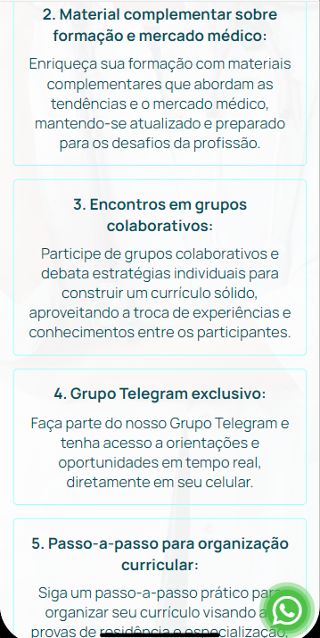
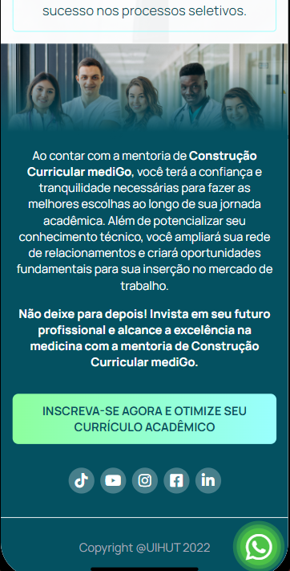
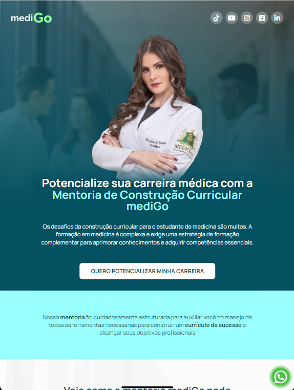
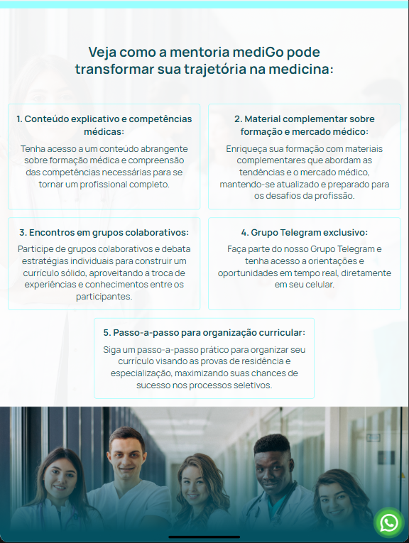
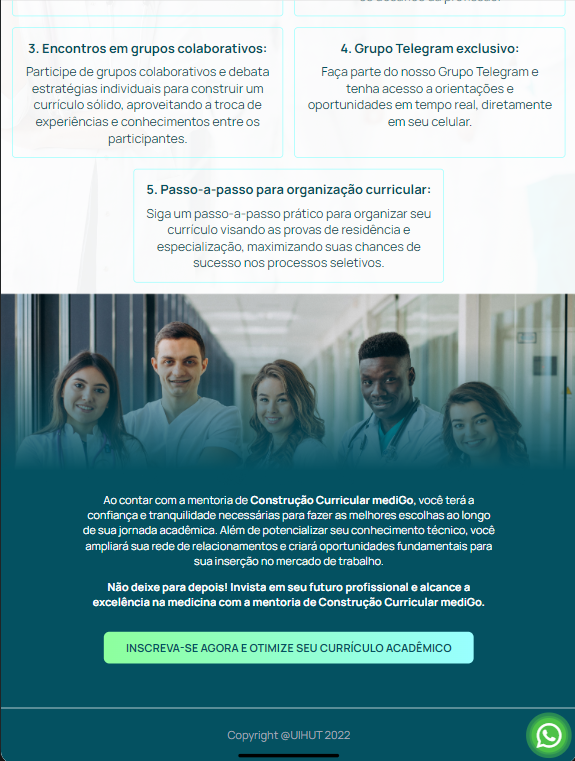
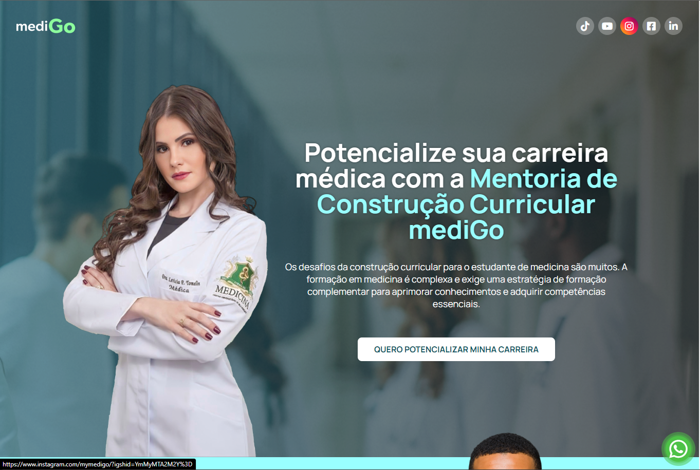
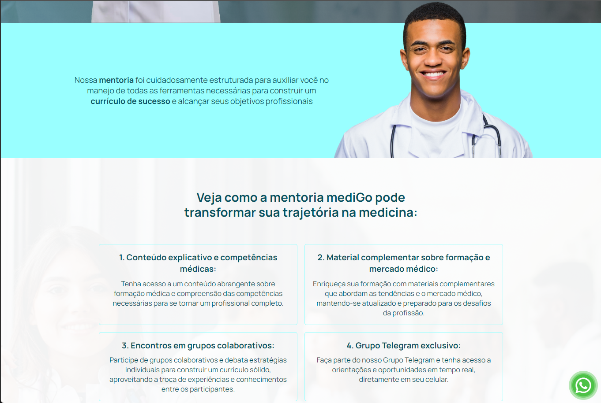
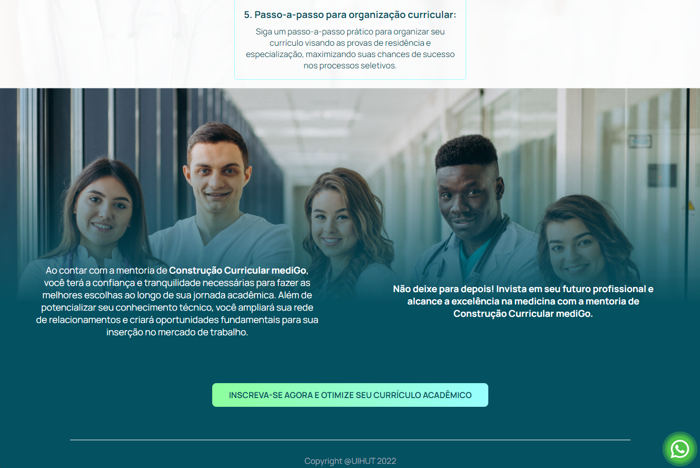

# Mentoria-Nota-10
Freelancer landing page mediGo

## Imagens 🎞️
### Mobile 📱

  
  
  
  

### Tablet 

  
  
  

### Descktop 🖥️ 

  
  
  

## Sobre

Essa landing page criada para a empresa mediGo, foi entregue o protótipo criado no figma para que eu desenvolvese,
apliquei alguns padrões pois o protótipo não seguia um determinado padrão,
o cliente pediu que o deploy fosse feito mesmo faltando o link no botão principal.

### 🛠️ Construído com

<a href="https://mentoria-nota-10.mymedigo.com.br" target="_blank">ver projeto 🔗</a>

